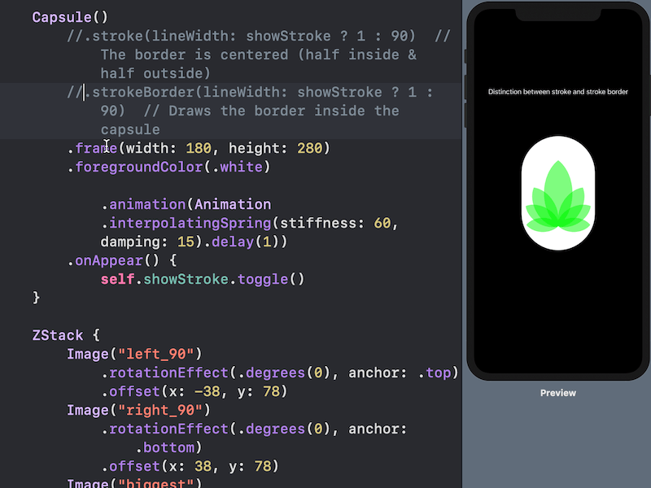
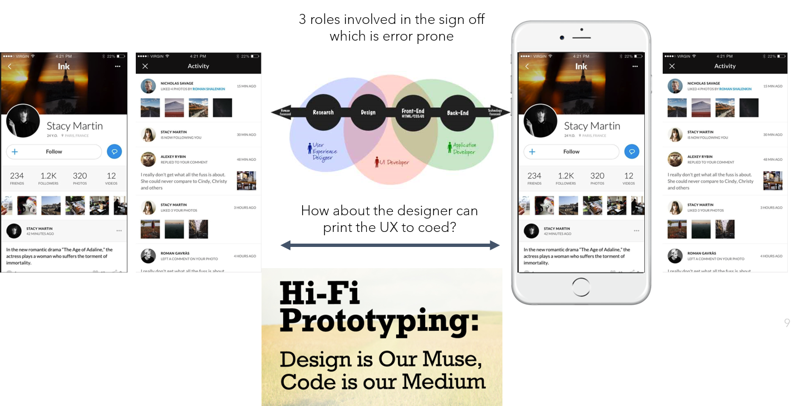
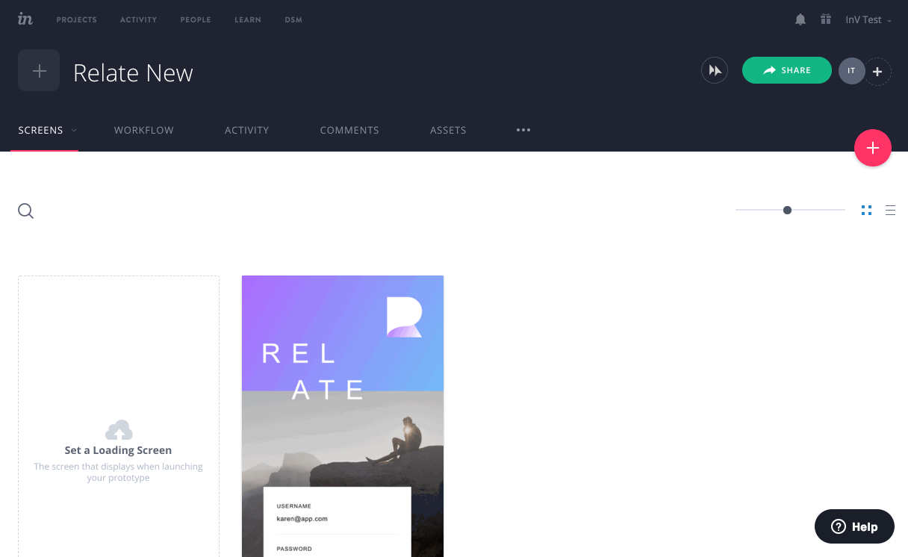
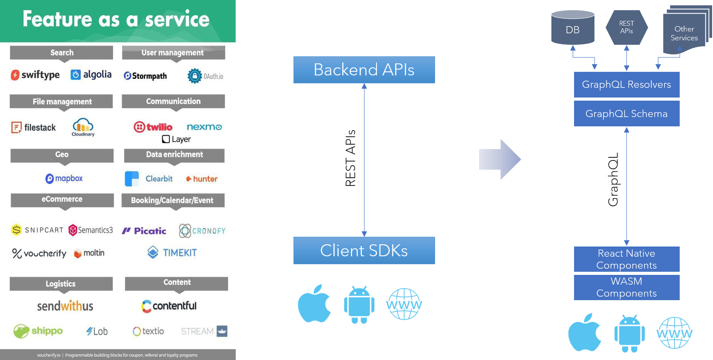

移动App作为移动互联网最重要的商业模式已经成为1000亿美元的巨大市场，随着手机硬件升级速度的变慢，移动app的生态价值越加重要，当前的移动App生态由iOS和Android主动，移动web app在移动互联网早期发展中起到重要作用，但是也因为体验难以匹敌原生app，沦为二等公民，但是其开放的信息互联模型和分发方式依然有强大的竞争力。新一代的App发展受制于新体验、新生态和新技术等多方面的影响。

#### 1、	新的consumer device
例如：AR/VR，代表了新的spatial computing时代的到来，旧有的web和app平台是为了2D内容高度优化的，分发方式，变现方式也和3D 内容是不同的。基于unity的游戏引擎的技术在多人交互、开放式信息模型、可信产业链等多重挑战下不可能还可以一家独大。
#### 2、	生态的分裂，可信软件供应链
导致旧有的分发模式和商业模式的变化，针对不同的市场需要使用不同的app分发方式和app变现模式，全球市场分裂，出现了中美市场之外的第三市场，这种分裂并不一定是负面的，对主导型的生态是负面的，对还在成长的生态则提供了一个机会，主要的机会在于第三市场的竞争策略，存在在全球美系super app的PWA方式转换，和非美app的HMS生态建设，开发者的技术和商业扶植。	
#### 3、	新技术的影响
web计算平台通过webassembly获得新的生命力，web应用可以获得性能和安全以及多语言编程，模糊了原生应用和web应用的边界，在spatial computing领域是非常有竞争力的平台，webassembly的进一步发展模糊了web应用和原生应用的界限，hybrid app增加了竞争力。另外，以react为代表的基于声明式UX语言、组件化UX和云端融合的数据交互技术成为前端技术的主流，也会对app的开放模式产生重大影响。

这些趋势都在驱动面向新时代的app开发模式的变革，利益格局将会重新分配

前文中已经讨论过了webassembly和基于webassembly和webXR构建AR/VR应用开发平台，这里主要讨论面向第三市场，通过新的技术体系，构建PWA开放web app模式，和HMS海外app生态体系构建，下面分别阐述。

PWA是对web网页的一种封装方式，带来的价值是一站式到达的开启方式和离线应用体验，如果支撑PWA运行的浏览器性能没有明显性能差异，PWA并不能够透明提升应用性能和交互体验。浏览器性能的主要取决于几个方面

#### 1、	渲染HTML/CSS的能力
  - CSS的并行化渲染能力，GPU渲染能力
  - HTML DOM 数据结构操作的效率
#### 2、	运行javascript脚本的能力
  - Javascript JIT 编译器的性能，虽然编译器已经取得很大进步，但是动态语言的性能和编译语言存在较大差距
  - Javascript应用是单进程，web app需要使用webworker机制实现并行化提速
#### 3、	网页内容的下载和缓存
  - JS的所有页面需要下载，不能本地存储，PWA可以使用service worker在背景进程做数据更新和缓存
  - JS是文本代码，minimize的压缩比低，下载慢
  
  
另外，受制于浏览器的限制，浏览器和原生app在用户体验上有差距

  - 原生app有本地存储能力，可以利用手机的sandbox安全机制，实现用户的长期登陆，不需要每次输入登陆信息，Super App里有不少是银行、支付等关键性的app，他们是高频应用同时对安全要求很高，原生app可以长期保持用户认证信息，可以利用手机的指纹识别、相机识别能力做快速用户登录认证，是友好体验的重要组成部分。
  - 访问本地设备能力，例如：影视频、蓝牙、照相机等
  - 更好的多任务机制，浏览器受制于安全模式，不能在背景运行，不满足导航、音视频播放、蓝牙IoT等应用
  
PWA 加速分为透明加速和非透明加速两种方式，透明加速，指的是可以不修改web app，使用特定浏览器就可以获得性能提升，或者对web应用做一次重新编译发布，就可以获得提升，例如：pwa builder。非透明加速方式允许对用户的web app代码做修改。

透明加速因为不能修改用户代码，性能的主要提升来做于CSS渲染，Javascript VM 性能提升，主要取决于浏览器厂家的进步速度，四大浏览器（Chromium, Gecko, Edge, Webkit）都是开源实现， 意味着不需要额外投资就可以跟着主干版本进步，例如：对Webassembly的支持，浏览器通过GPU支持CSS渲染。传统上浏览器都采用C++语言开发， 2006年Mozilla为了提升浏览器并行并行计算能力和安全提出了RUST语言，为了让浏览器获得原生应用的性能，RUST语言具备if it compiles, it is safe的原则，支持更简单和安全的多进程编程模式。Mozilla一直在开发基于RUST的servo浏览器项目，servo的css 渲染性能确实很出色，servo中的核心css渲染引擎已经被植入到firefox quantum浏览器，servo项目本身被用于支持AR/VR应用的firefox reality浏览器，因为这些应用对稳定和高速的3D图像渲染有更严格的要求，并且不需要支持传统的2D的大量技术负债。

自研浏览器可以基于需要和移动运行环境，选择组合不同的技术来实现浏览器性能的突破，同时PWA要处理的应用范围也远远小于一个通用浏览器，PWA方式运行的app也局限于大公司做的web app，这些app的质量和兼容性都会比较高，这都是自研PWA浏览器能够在性能和兼容性上做出比较好平衡的条件。

另外一种透明加速是对特定popular的web framework的加速，例如：react, angular, VUE等，可以通过替换其特定组件实现加速，PWA应用体验很重要的一方面是离线体验，在上述前端框架中GraphQL越来越多用于和后台数据服务的交互，基于GraphQL实现的本地缓存和离线sync 机制简化了PWA应用开发，其他的noBackend技术例如pounchDB，Howdie等也被用于简化前端离线数据访问和后端数据源的同步。

非透明加速，应用需要做适配，轻量级适配例如通过特殊的html/css tag来触发特别渲染能力，重量级适配需要使用特定的framework和高效编程语言
  - 因为浏览器的迭代速度很慢，很多重度使用graphics渲染的公司在浏览器内做一套私有的CSS渲染机制，所谓的browser in browser，最典型如，flipboard电子杂志的react-canvas通过canvas机制在实现部分高性能scrolling和翻页等UX机制，这种特别渲染的触发基于自定义的HTML tag，实现了和CSS混合渲染的效果。Figma完全实现自己基于C++和webgl的2D 图像编辑引擎，通过Webassembly运行在浏览器内，当然它的html网页内部的渲染都是自己引擎接管了。
  - 另一种是用高性能语言取代Javascript，因为webassembly已经可以支持对DOM操作，例如：微软的blazor使用C#替代Javascript作为web app的编程语言，asm-dom使用C++编译为webassembly作为web app的编程语言（https://github.com/mbasso/asm-dom），yew使用RUST语言作为web框架的编程语言（https://github.com/flosse/rust-web-framework-comparison#frontend-frameworks-wasm）。
  - 对一些web app的计算密集模块做Webassembly的卸载，通过API提供能力给javascript应用，构建混合应用，例如：音视频编解码器，物理引擎，Canvas，SVG渲染能力

从用户体验上来看，PWA web app需要一些新特性来进一步缩小和原生app在交互体验上的差距
  - 和手机的认证机制紧密结合，支持FaceID，指纹登陆等，这个需要对app做改变，需要和auth0等id提供商合作
  - 和手机的设备访问能力集成，设备能力通过WASI暴露给WASM，WASM使用C/C++，RUST高性能语言开放，提供给web app，可靠访问camera、bluetooth、音视频player
  - 支持更好的多任务机制，支持web app在背景运行，对于音乐、地图类应用很关键

如上图所示，随着webassembly的使用，非JavaScript语言可以通过编译为webassembly语言来完成和JavaScript一样的功能，例如：操作DOM，访问浏览器提供的API，同时底层的渲染机制也石百花齐放，可以完全不依赖于DOM而直接构建自己的图形体系，尤其一些基于C++的高性能图形库已经可以被编译为webassembly（https://magnum.graphics/），未来的混合型web app会越来越多的。

加上Webassembly system interface types的逐步完善，web成为非常类似传统操作系统的计算平台，即浏览器未来的发展会向基础计算能力发展，强调性能、安全和对硬件平台的优化和对设备的支持，而业务层的创新将会在Webassemly层进行，最典型WebXR、Web Machine learning这样的特性，完全可以由应用开发者自由发挥，通过技术和生态的竞争决出胜负，而不需要W3C这样的标准组织通过标准的方式来判决胜负。这种趋势将会导致web平台和android、iOS直接竞争，但是因为web并不被单一厂家控制，而且通过webassembly这层抽象，也脱离了对单一编程语言的依赖，同时还继承了 web的超链接开放信息模型和Internet庞大基础设施的支持，new web平台在多样性和bottom up创新上的竞争力不可小觑。

新的app开放方式解决的另外一个问题是如何能够更好的通过丰富的HMS生态服务、先进的工具和框架以及新的app开发技术服务第三市场的app开发者，让他们能够更快、更高质量的构建出自己的本地的app生态。下面主要围绕前端技术的发展变化展开。

随着Apple 2019年发布SwiftUI, combine项目，Android阵营发布与之对标的jetpack compose，AndroidX组件库，标志着原生移动App也全面接受了React开创的前端技术的基本思想，即：组件驱动的开发（Component Driven Development）、声明式UI（Declarative UI）和前后台基于graph的数据流动（GraphQL）。这些技术的应用带来的效果是，团队可以大规模的共享代码和协作开发，代码质量因为不断组件化而提升，GraphQL成为REST之后的前后台数据交互协议，统一了前端和后端的数据视图，和组件结合在一起，组件不仅仅描述了前端的UI也内置了和后台GraphQL组件数据集成的逻辑，从而进一步强化了组件化架构。

如果回看app发展的历史，90年代中Windows桌面图形操作者系统迅速崛起，急需桌面应用开发工具，Borland公司的天才软件设计大师Anders Hejlsberg，操刀设计了著名的Delphi集成开发工具，其中最重要的特点和上述的所谓的最前沿app开发技术并无重大区别，Delphi也是基于组件驱动的开发流程，Delphi的OCX控件包裹了完整独立的功能，可以是可视的，例如：图表、地图，也可以是数据库、数据连接器等非可视的，程序员使用拖拽界面可以快速生成UI，并在同一个IDE界面做逻辑代码的编程。

Anders Hejlsberg 1996年被微软重金挖走，为微软成功开发了Microsoft Visual Studio，C#语言和.NET框架，其中所见即所得开发方式，ActiveX控件等仍然是核心要素，至今仍然是Windows开发者生态的重要基石。于此同时，web开始兴起，web的特点是极端的开放性，没有任何一家公司可以控制web生态和强迫开发者采纳某一种开发框架，导致web前端开发技术以一种无序状态在演化，从好的方面说，是百花齐放、天才辈出，从坏的方面说，web应用开发从来没有给开发者Delphi这样好用的开发工具和组件生态。而移动应用的开发从一开始就是大公司主宰的封闭生态，遗憾的是iOS和Android开发思想和工具也一直没有达到Delphi或者Visual Studio的水平，SwiftUI的实质就是给了程序员一个WYSIWYG的UI设计工具，这已经是Delphi面市23年以后的事情了，而iOS至今还没有一个基于组件的生态，Android也才开始建设。React和React Native是Facebook为了能够大规模开发web app和移动app所开发的前端技术框架，其最大的创新点就是回归了组件化开发的思路，使用声明式的JSX语言把UI组件的可视描述和逻辑代码统一在一个文件，组件通过redux机制实现了单向MVC数据流动机制，后续为了减少前端数据和后端数据服务交互的复杂性，引入了GraphQL，JSX声明式的风格使得支持native app组件渲染也非常自然。至此React已经基本统一了web app和hybrid app的技术标准，web开发的前端技术终于从上百个收敛到手指头能数清楚的几个，Angular，Vue也都不同程度吸收了React框架的核心设计思想。

 

当然历史式螺旋上升的，移动应用开发的交互体验、功能性、性能要求等和当初的windows应用开发不可简单对比。
前端应用的另一个特点是设计驱动（design driven），主导app开发的是产品经理和UX、交互设计师，即使很小的app团队也会有这两个角色，而不会由软件工程师来做UX设计的工作。SwiftUI这种UI设计工具需要设计师懂swift编程语言，这和实际不符，大部分的UI设计师是不会编程的，他们使用的是photoshop，sketch，Auxre XP这样的前端设计工具，这些工具可以生成高保真的页面设计，甚至是可以实时交互的高保真原型，可以用于和客户互动来迭代需求，直到UX设计流程完成，设计图样交接（hand-off）给工程团队去做代码实现，工程团队需要尽可能实现UX交互的效果，如果由技术实现的困难还需要和UX团队协商修改。

设计驱动的始作俑者是Apple，Apple的设计师是产品流程的owner，工程师团队只是他们设计打印机。这个流程被拷贝到移动应用的开发流程，乃至web app开发。围绕原型UX设计也已经出现了一个工具生态，运行设计师和客户实时互动迭代设计，允许设计师团队实时分工协作，原型设计工具可以产生高保真的产品交互原型，运行在手机或者网页，设计驱动的极致目标就是把工程师团队这台打印机完全自动化，最终实现低代码（low coding）开发或者无代码（no coding）开发。

从代码实现侧来看，随着组件化架构的采纳和组件生态的逐步繁荣，80%的app代码都可以使用现成组件实现，需要定制化的代码规模越来越少。组件包括UI组件，提供方主要是设计师，也包含特性组件，提供方是各种SaaS业务平台，SaaS除了提供云端API也越来越多地提供app级别的SDK和组件，即所谓的Feature as a Service。

这个趋势是不是和云端的cloud native应用开发趋势是一致的？只是组件这个名字要换成micro service，其实质是类似的，即组件化、可组合的软件开发方式将会导致大量的应用开发可以通过组合后端微服务和前端的UX组件来实现，需要定制的代码越来越少，而且主要集中在粘合逻辑。依照这个逻辑去对比前端组件开发和后端的微服务开发，我们可以看到前端技术还缺乏一些必要的工具链，来自动化前端组件驱动的开发方式。如下图所示，组件仓库已经出现了bit，storybook这样的协作组件开发平台，后端k8s这样的微服务框架性技术在前端开发中还没有明确提出来，虽然JSX这样的声明式UI编程语言已经具备了某种对component的配置、layout的能力，但是还需要加入一些数据粘合的成分才能真正匹配k8s通过blueprint脚本自动化部署的能力。

剩下的一个关键问题是在UI设计师的工具生态和代码工程师的组件化自动化实现之间搭建一个互通的桥梁，这是实现UI自动打印出代码的关键。借用编译器的概念，我们需要定义设计和代码实现之间的UI IR（Intermediate Representation），这是标准化前端设计组件和app代码组件的关键性标准，通过IR可以有效建立和前端设计工具生态的合作，使得UI的handoff过程输出的数据格式标准化，这样也极大提升了前端设计工具low coding的价值，同时UI IR对backend，即各种app的组件框架的自动化编译能力，编译生成的JSX、SwiftUI或者其他声明式UI程序脚本，也即app组件代码的构建蓝图。UI IR 从而可以实现设计驱动全流程的自动化。

前端设计工具一般都支持通过plugin机制来读取UI设计的功能，这样视觉设计可以转变为UI IR描述，并且也实现了类似面向对象设计软件这样的可以从主设计模板继承开发设计模板的模板体系，对设计师的设计空间的约束是有限的。

围绕UI IR标准可以规范面向设计师的App UI 设计模板，这些模板都需要符合设计工具输出UI IR的一些需求，例如：命名，数据表征，元数据标注等，这些模板的基础元素可以基于一个符合UI IR的主模板生成，同时也需要把app代码组件尤其是FaaS组件映射回设计模板，这样设计师可以直接选取FaaS的设计组件做设计，而不需要凭空创造。

业界已经由一些SaaS服务和开源项目试图自动化从UI设计工具到代码生成的流程，例如appchef项目，已经实现了把基于sketch模板设计的UI之间转换为React Native组件源代码的功能，设计师通过sketch plugin可以一键生成原型App和App的源代码。

