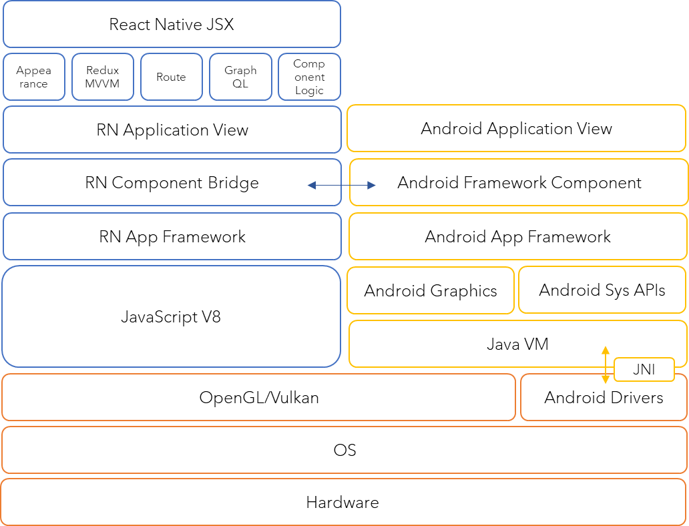
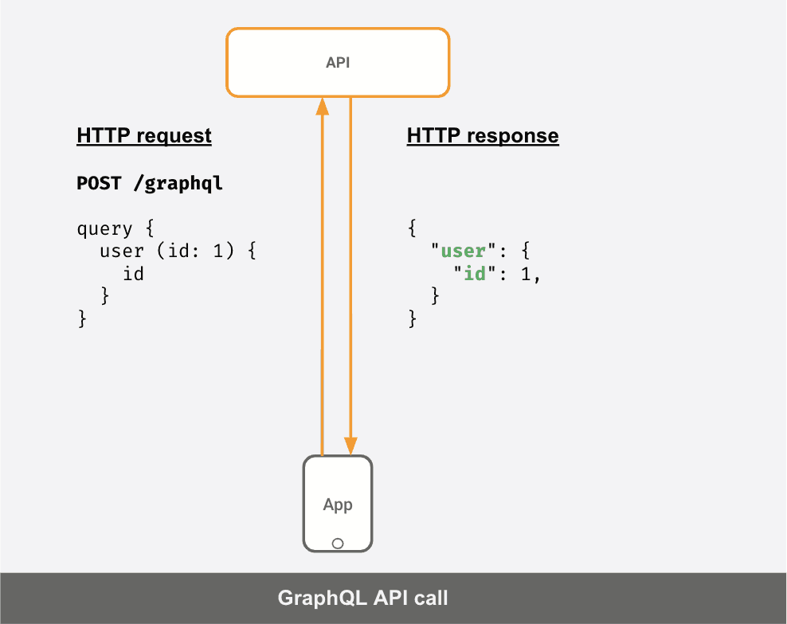
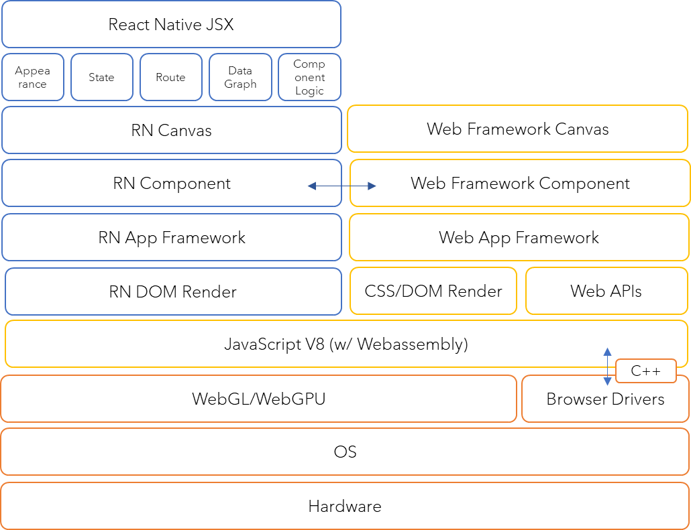
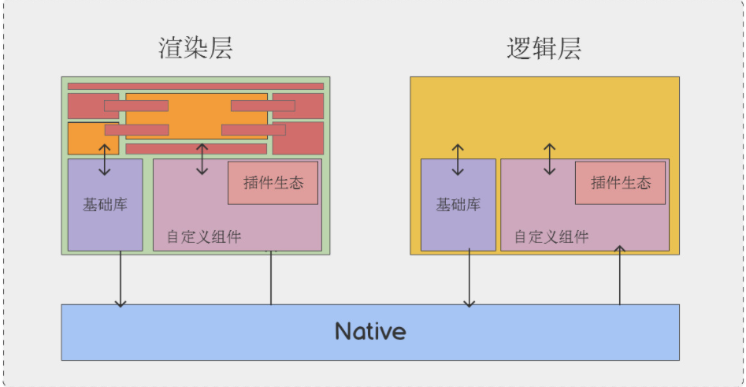
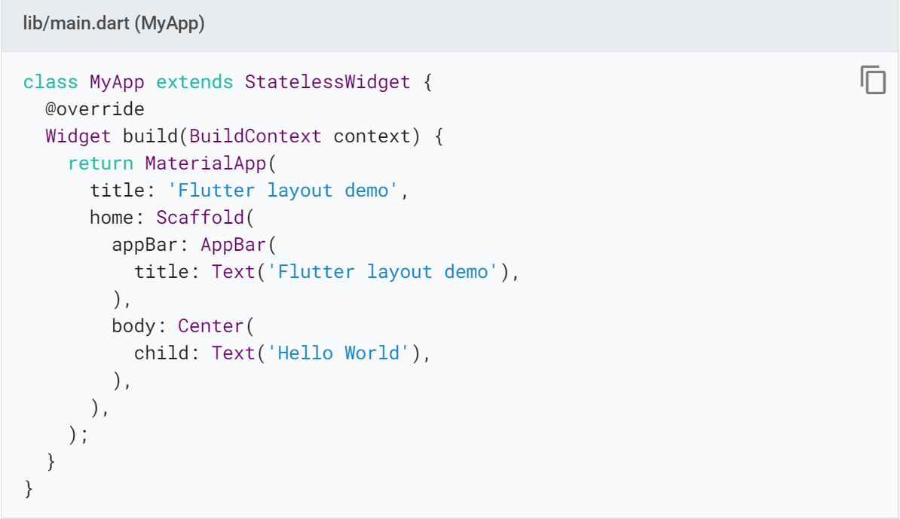
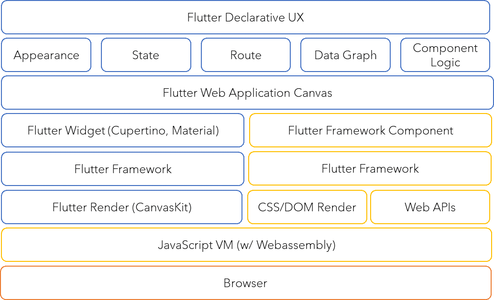
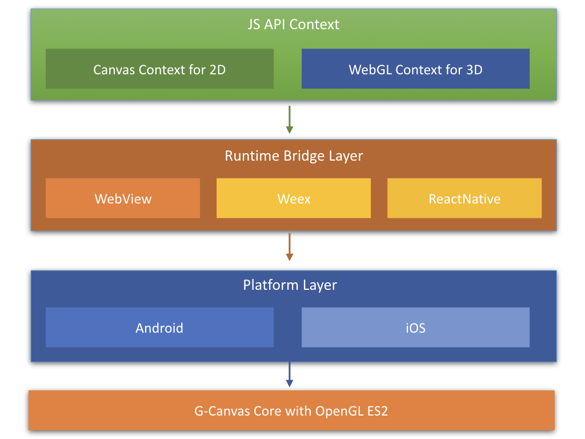
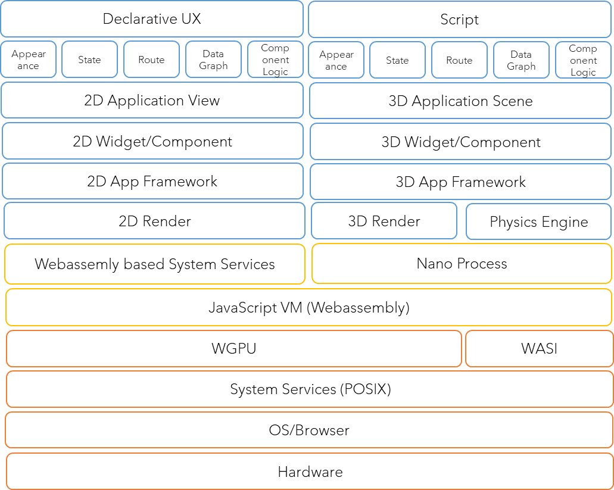

秉持“Code once run everywhere” 理念的跨平台应用开发技术从移动应用诞生之始就一直有需求，也出现了cordova，react native，flutter，weex等开源的框架技术。除了代码共享，开发便利等因素，跨平台应用开发还存在其他一些更强烈的诉求。
 1. 随着个人消费者设备逐渐增多，用户的手机，pad，pc，电视，手表，汽车，AR/VR设备等设备存在强烈统一用户体验，数据共享，无缝交互的需求。
 2. 基于app store的中心化分发方式，从最初的app质量安全保证，提供分发和应用内购支付的便利，演变为信息控制中枢，垄断了用户和app的关系，也成为地缘政治的管制手段。最近epic game和apple，google就epic的游戏内购发生争执，遭到两大store下架，迄今还没有和解，用户喜爱的fortinet等游戏不能得到更新，另一边tiktok、微信等企业在地缘政治争端中被无端当作人质，曾经自由开放的互联网变成被两大app商店垄断的市场。
 3. 另一方面，随着super app的兴起， app需要以不同的形式被super app集成和触发，例如在微信，美团，地图应用等入口平台进行小程序形式的分发，新的交互方式例如：语音识别，要求能够直达app内的服务，app需要有足够的平台适应能力，应用逻辑和UI呈现都能够适配不同平台的需求。

这些驱动力和相应的技术平台的进步会对目前的原生app生态产生重要影响，未来跨平台的应用，可以称为universal app，将会在开发方式和分发方式上满足上述诉求，基于目前跨平台应用开放呈现出来的趋势，下面总结一下universal app的技术需求。

Universal App的产品需求。参考云计算的12 factor app需求，有类似的地方
 *	UI的声明式描述
 *	平台适配能力，显示尺寸，布局方式，交互方式，组件外观
 *	MVVM模式的单向数据流动驱动UI， UI 受state驱动刷新，state是immutable，通过function改变
 *	平台能力的包装，对系统API访问的一致化包装，
 *	原子化服务能力，App的feature可以route直达，deeplink，提供URL服务定位
 *	View对数据的依赖通过model结构，model包含本地和远端数据，model使用data graph对应后端和前端数据，减少串行化开销
 *	离线服务和在线服务不区分，离线运行需要的asset缓存，数据访问通过model，model提供本地储存和缓存以及后台更新能力（service worker）
 *	个人云，个人敏感数据的存储使用服务化机制，可以使用本地化存储机制
 *	用户登陆和认证，使用mobile ID是首选

基于上述对Universal App的需求，首先回顾一下跨平台的app架构

#### 基于HTML5的跨平台应用架构
在移动互联网发展的早期因为原生app生态不健全和开发者不多，通过把web应用打包为原生应用可以短期内大量提供移动应用和内容，体验上接近移动应用，所以还有不少的接受度。在架构上，Android和iOS都提供应用内嵌webview的能力，基于HTML5的混合应用运行在webview模式，和通过浏览器运行的纯粹web app不同的是，这种混合应用通过一些plugin能够访问原生的能力，例如：硬件外设的访问，地址本的访问等。另外，web应用的javascript代码，HTML/CSS代码和需要的资源可以打包作为应用分发，应用直接从本地文件系统加载这些代码和资源而不需要从网上下载，性能获得了提升。但是，本质上这个架构的性能依赖于浏览器，浏览器需要对web应用的HTML DOM和CSS做即时编译和渲染，而原生应用不需要，web应用使用javascript语言虽然是JIT编译，但是在多线程和语言设计上和原生语言存在差距，这些都导致了web应用性能落后于原生应用。

#### 基于原生component的跨平台应用架构

FB开源的React Native是最有代表性的混合应用架构，下图是RN在Android系统内的架构描述，包括下面一些重要的特点
基于JSX DSL的声明式的部件描述机制，单向数据流驱动的MVVM（Model-View-ViewModel）UI架构，和后台数据集成的GraphQL技术。RN 的代码使用Javascript开发，实际运行于目标平台的JavaScript VM，而不是webview，通过把原生部件的API暴露给JavaScript端的RN进程，RN可以使用原生部件，从而获得大部分的原生性能，而且在app的外观和操控上和原生App保持一致。RN架构使用JavaScript和类CSS/HTML的部件描述语法，对大量的web应用开发者门槛比较低，但是又能获得比HTML5更好的接近原生应用的性能，所以得到了大量开发者的支持。

React框架里面一个重要的部分是JSX，在传统的web应用中，包括了三部分编程能力，一个是HTML描述页面内容，包括文字、图片、音视频，对这些内容还可以叠加事件驱动的脚本，脚本使用JavaScript编写，使用 CSS可以对这些页面内容的尺寸、位置、布局颜色、字体等排版和修饰，这三种语言被分为单独的文件，所以任何对部件的修改都需要修改三个不同的文件，难以管理，JSX通过对JavaScript做了语法的扩展，在JavaScript中内嵌HTML和CSS，这样在一个文件使用JSX就可以完整描述一个UI部件。下面是一个例子，定义了一个button部件，包括使用HTML Tag定义文字区域，在同一个文件中还可以定义点击button的事件逻辑，部件的state定义为ViewModel的全局状态，对状态的更新可以触发button重新被渲染。

React的MVVM单向数据从model驱动view更新的架构也在前端架构中获得了广泛应用，在这个架构中view的更新是由其state变量的修改驱动的，state的变更可以是View Controller中的用户输入触发的，也可以是model中后端数据的更新触发的，但是view只能被state的状态变化这样一种方式触发更新。

而在传统的MVC架构中，controller可以直接修改view的变量，model中变量本身的修改也会触发view更新， 存在多种不同的路径来更新view，例如angular最初的架构，这样难以把部件做成无状态，对涉及团队开发的中大型应用难以管理。

RN还开发了一种新的前后台数据交互的协议，取代传统REST API。REST（Representational state transfer）发源于2000年，当时解决的问题是SOAP这种企业级的RPC协议，在互联网场景下有大量的协议代价，REST 充分利用了HTTP协议作为一种传输方式和作为一种RPC实现，简化了互联网场景下前后台数据交互的RPC设计，可以更有效利用带宽，在宽带互联网和移动互联网发展的早期是可取的。但是也带来了数据串行化的开销，前端应用对数据的呈现是data graph，例如一个用户的profile，一个订单的信息，一个商品的描述，可能会触发多个REST API，前端需要把页面数据分解为响应的REST API呼叫，对返回结果映射回组件的数据域，前端需要理解后端的服务结构，而且要管理大量的REST API呼叫的异步逻辑，数据的打包和串行化等，随着网络带宽和延时的改善，REST API设计收益变小，而带来的前端数据出力的代价日益成为负担，GraphQL是一种新的前后台数据交互的协议，前端使用和页面呈现非常接近的data graph来描述数据关系，通过graphQL的客户端传递到后端的GraphQL resolver，resolver提供对graph中query字段的查询和填写，然后把处理完成后的graph返回给前端，前端不关心Graph的传输过程。GraphQL作为REST API的替代获得了广泛的使用，使用最多的前端框架都已经支持GraphQL。

还值得一提的是React Native Web，既然有了react，为什么还需要react native web呢？这两者的区别是react是面向web应用的前端框架，它底层是通过把react的组件转换为DOM，然后调用浏览器本身的渲染能力做应用渲染，而react native底层依赖于原生平台的组件，react相比react native的组件设计空间要大的多，用户如果要实现同一套代码跨平台，在原生平台使用RN，在web平台必须使用react，这样组件不存在对应关系，设计流程也不尽相同，react native web在移动web端实现了一套和原生平台兼容的组件库，这样react native项目在原生平台和web平台可以不仅仅可以实现大部分的代码共享，而且应用的外观和UX体验也非常接近。

另一个使用原生组件能力的混合应用框架是微信小程序，在小程序架构里，有两个webview进程，都使用javascript编程，一个负责应用页面的渲染，这里也引入了微信自行开发的标记语言WXML和WXSS，实现了HTML和CSS的一个子集，使用Javascript做应用编程，为了提升UI的性能，也引入了一些原生组件，这些组件可以和webview渲染在同一个canvas上，另一个webview进程实现逻辑功能，这个进程并不能直接访问UI webview的DOM，而是渲染到一个虚拟DOM数据结构，然后通过平台原生程序实现逻辑对UI webview的访问，原生程序可以对逻辑功能做安全检查和提供一些平台API的访问能力。这样一种设计让小程序全程运行在微信应用的两个webview沙箱内，有很较好的安全隔离，由于是web应用，可以实现小程序的持续升级，另外，原生API，例如：用户档案，社交圈等数据也能被web应用访问到。这样的架构社交是小程序应用场景决定的。

#### 基于自带组件的跨平台架构

Google开源的flutter 框架是另一个跨平台应用框架，借鉴了react项目的很多设计，例如声明式的组件编程，在flutter里面叫做widget，单向数据流MVVM 状态管理等，但是也有重大的区别。首先flutter使用dart语言开发，其次flutter实现了自己的渲染引擎，而不依赖于原生平台提供的组件。从架构上，flutter类似于unity这样的游戏引擎，因为游戏的开发流程和渲染需求和移动应用差异很大，所以游戏引擎通过自己在原生平台的构建的runtime完成渲染和应用框架，游戏应用和游戏引擎runtime最终编译到一起，作为原生平台的一个AOT（Ahead of Time）编译成的machine code部署。在flutter框架下也是如此，flutter有针对Android，iOS和web实现的runtime，runtime提供了widget库，应用框架，渲染引擎，dart VM或者是dart 语言runtime，以及访问原生能力的API实现，flutter应用必须加载到这个runtime上才能在原生平台运行，应用开发阶段应用运行在flutter提供的一个shell内，这个shell提供了dart VM和其他一些开发支持，应用发布的时候回通过AOT编译为machine code，在Android平台编译为NDK代码，然后通过一个Android应用的runner加载，在iOS平台，编译为LLVM target，也通过一个iOS应用的runner加载。在运行过程中，应用的界面渲染，用户输入管理都被Runner分配给flutter应用代码处理。

Flutter的widget声明式描述，借鉴了JSX，使用dart用单一文件描述组件功能，style和处理逻辑。

Flutter也使用单向数据流更新UI的MVVM模式，有不同的开源框架实现对组件和页面状态的管理。

Flutter Web 在2020年初发布，真正实现了code once run everywhere的目标，这个实现中的render有两个路径，一个是使用浏览器的渲染通路，使用基于HTML/CSS的widget实现，类似于RN web，好处是因为并不下发flutter render代码，所以代码尺寸小，首页显示快，另一个渲染路径使用编译为Webassembly的Skia渲染引擎，称为CanvasKit，和在原生平台实现基本一致，这样也可以重用在原生平台使用的widget，性能也会比使用HTML/CSS渲染的方式更高。在flutter web实现中，dart语言通过dart2js编译为JavaScript代码，在浏览器的JavaScript VM运行。

Flutter使用开源的Skia图形引擎，Skia 项目团队2005年被Google收购，此后一直由google团队负责维护，Skia也是Android使用的图形引擎，Flutter重用Skia会获得更好的支持。Flutter在Skia之上实现另外全套的渲染pipe line，主要是一个的组件的树形结构，可以很好的和widget的view更新同步触发渲染流程。
Flutter Web 使用Webassembly编译	过的Skia图形引擎实现了在web浏览器内运行和原生平台一样的渲染pipeline，很多基于web的游戏引擎也基于同样的思路把基于C++实现的图形渲染引擎和物理引擎通过Webassembly技术运行于浏览器。Unity也通过webassembly建立了一套运行在浏览器的runtime，成为unity支持的另外一个目标平台。

阿里的weex是和flutter类似架构的跨平台应用框架，weex面向用户的应用层框架使用很流行的vue.js，vue借鉴了react的一些设计思想，但是比react简化，没有jsx，中文社区支持好，vue的开发者尤雨溪也加入了阿里团队。Vue的最初设计是web应用框架，weex打通了vue组件在原生平台的实现，weex内部最核心的一部分是GCanvas，它实现了HTML5 canvas的完整API，weex基于canvas实现了原生的组件能力，和flutter类似，是携带原生组件的跨平台方案。和flutter不同的是，vue的组件描述是基于html和css的，因此weex需要支持html和css语法实现的组件，这部分组件的渲染是通过原生平台的webview来实现，也可以支持HTML5 Canvas语法实现的原生组件，这部分的渲染是通过GCanvas实现，而不是使用webview，这种混合渲染方案中，webview成为一个后备可靠方案，使得基于Canvas实现的原生组件可以由足够的时间来进化和扩展生态。

对上述跨平台应用框架的分析可以总结出一些共有的特性，如下图，有共性的总结
 

1．	基于组件化的应用开发方式，这也是软件开发的一般理念，组件封装可以让前端开发变为堆积木，大公司内部经过多年的发展已经形成了高度可跨平台重用的组件仓库，基于流行前端框架的开源和商业组件库也已经形成气候。如上文（https://mistyminds.github.io/mistyminds/%E6%96%B0%E4%B8%80%E4%BB%A3%E7%9A%84app%E5%BC%80%E5%8F%91/）介绍的内容，基于DSL语言描述的声明式组件已经被iOS，Android和其他前端开源框架所采用。这里不再赘述。
2．	前端应用框架也都基本采用了MVVM的交互模式，通过统一全局状态管理来管理用户输入和数据更新导致的UI更新，不管是React，Flutter，Vue这样的开源框架还是iOS和Android，都在这个架构上获得了共识。
3．	GraphQL作为REST协议的替代，也在前端框架获得了广泛的支持，后端的mango，firebase等移动后端数据服务也都提供GraphQL的服务。
4．	应用框架的组件设计，存在重用原生组件，自带组件等设计，但是在现实实现中，基本都是混合实现，iOS和Android生态经过近10年的投资，产生了大量的代码资产，不能重用这些资产将会导致巨大的浪费，和原生平台的交互存在于访问原生的部件，和原生程序能够相互调用，以及在图形render层面可以混合render这些地方。
5．	在编程语言层面，JavaScript因为其广大的社区，还是最受欢迎和上手最快的前端语言。Flutter虽然有很多技术优势，但是其DART语言的选择是其生态薄弱的一个主要原因。JavaScript作为一种解释性语言，天生存在性能缺陷，例如不能AOT。要开发出DART这样既能以VM方式工作又能编译为machine code runtime的前端编程语言门槛很高。Webassembly的出现为编程语言选择提供了巨大空间，不管是是使用既有语言还是开发新的轻量级UI语言，门槛都被降低了。
6．	图形渲染引擎方面，Skia在2D渲染上占有绝对的优势，通过flutter项目，Skia也证明了其跨越mobile和web的能力。图形引擎和上端的部件描述语言和状态管理一起联合设计，可以获得不少优化空间。

从上述对跨平台应用框架的分析，还可以看出， iOS和Android提供的原生开发工具，应用框架和开发流程本身不适合大公司的需求，大量的应用框架层的创新都是大互联网公司从其业务和开发团队实际需求出发开发出来的，从用户体验上比iOS和Android原生的应用开发工具和流程更适合开发者的需求，Android Studio和Xcode 的开发体验难以匹敌RN或者Flutter提供的支持live reload和团队协作能力的开发工具，更没有提供组件全生命周期管理，设计师和开发者可以紧密协作开发和维护组件的工具平台。两大移动平台因为垄断带来的自满和倦怠显露无疑，新的移动平台可以考虑通过和开源框架生态全面合作，通过底层平台能力和上层开源框架的全面适配而提供给开发者更好的开发体验，全面融合硬件能力，在保证用户隐私和安全的情况下，尽可能扩展开发者可以创新的空间。

随着W3C在2019年底正式标准化了Webassembly，在四大浏览器全部支持，Webassembly成为浏览器内一个新的跨平台计算平台，基于Webassemly开发的Universal App可以满足很多急迫的需求。

 1.	提供一个基于开放互联网模式的新的应用分发方式，可以绕过app store对分发的垄断，建立自己新的应用分发方式。
 2.	受制于性能限制而无法互联网化的桌面应用，借助Webassembly提供的原生应用运行能力，做SaaS商业模式和协同工作模式。2005年因为ajax技术的进步，出现过一次协同工作的生产力工具创新的热潮，出现了gmail，google wave，wordly等产品，google通过一系列并购形成了google doc产品族，和Microsoft office形成竞争，google doc虽然性能不如桌面版的office，但是其subscription的商业模式，协同办公的能力，帮助其赢得了大量的市场，例如整个学校教育系统。Webassembly的出现也会助力desktop应用向SaaS方式和协同工作的迁移。
 3.	在Android和iOS平台，除了原生应用框架之外，为了支撑浏览器，游戏这类依赖于bare metal原生计算能力的应用，也提供了一个直接访问底层硬件和图形能力的口子，flutter这样的新的应用”OS”才可以“寄生“在Andriod和iOS平台，逐渐演化，而不需要一开始就直接推Fuchsia平台。Webassembly在浏览器内提供了类似的bare metal计算方式，提供和Android和iOS一样的底层访问能力，例如：WebGL/WebGPU，Camera和USB等硬件设备，文件存储能力，同时支持多语言编程，这点又高于Android和iOS，加上基于web的开放访问模式，不被app store限制，所以是一种更适合应用”OS”创新的环境。

现实世界已经出现了不少基于webassembly的web应用，是上述对Webassembly提供的新跨平台解决方案的能力的一个验证。
 1.	游戏类，因为游戏越来越依赖虚拟道具资产等应用内购收费，这也是和apple，google 应用商店产生冲突的原因，因为30%的过路费太过昂贵，而游戏本身并没有太多借助store的营销能力，好的游戏IP是稀缺内容，不需要store的营销。游戏引擎因为要支持游戏机，PC和移动设备，本身已经具备跨平台能力，游戏引擎有大量C++代码资产，rust也成为游戏底层平台的热门选择，这两种语言是webassembly首选语言，而且游戏依赖于GPU渲染，而浏览器内提供几乎没有损耗的WebGL和WebGPU访问通道。基于上述原因，游戏类应用有很强的商业动机和技术成熟度向Webassembly迁移。
 2.	XR类应用，同上述原因，AR/VR应用开发目前高度依赖游戏引擎，商业模式上，AR/VR最有前景的商业也是虚拟物品交易，如前文分析，Unity等商业游戏引擎并不很好支持AR/VR应用的开放世界和多人交互的场景，从发展前景上来讲，AR/VR被视为下一代终端，各大公司不希望自己的技术平台和用户被Unity这样的商业引擎绑定。从Webassembly社区来看基于C++的渲染引擎和物理引擎都已经完成了Webassembly的迁移，面向开发者的框架，例如Babylonjs等也发展很快。Mozilla专门推出了基于其servo浏览器技术的Firefox Reality WebXR浏览器，试图在AR/VR这个新计算平台布局成为新的OS。
 3.	对图形引擎和媒体能力要求比较高的业务，例如：地图导航类，媒体播放类，短视频社交类，实时通信类，通过Webassembly对其C++代码和媒体编解码能力的支持，可以在web平台获得和原生平台类似的性能。因为地缘政治的冲突，这类通过应用通过app store分被分割为碎片化的区域市场，通过web方式变为互联网网站，无论刚从政策和技术上都要比app模式更加难以被阻止访问。例如Google Earth团队已经发布了一个webassembly版本，和原生应用相差无几。ZOOM的web客户端已经使用基于Webassembly的编解码器和WebRTC实现了高质量的音视频通信。
 4.	图形工具类应用，例如：图像处理软件，CAD设计工具等，这些工具对2D/3D图形渲染能力要求较高，一般自带渲染引擎，这些图形引擎编译为Webassembly运行在浏览器中，通过web开放式访问机制，这些应用可以在传统license模式之外提供SaaS服务模式，web还提供了最重要的实时交互和协同工作机制。Figma，Autocad通过Webassemly提供了可以实时交互协同和基于SaaS订阅商业模式的web客户端。
 5.	一些跨平台框架和super app可以通过Webassembly提供基于其生态的新应用分发，例如：微信小程序，inoic，react生态中的开发平台，试图在app store提供平台类的应用服务，但是其商业模式和app store冲突，所以纷纷被下架，只有微信因为体量太大得到了豁免，这些平台可以基于Webassembly构建“OS” in browser，形成基于浏览器的应用开发和分发平台，而不用担心被app store下架。

如上述跨平台的Universal App框架的分析，编程语言的性能和语言的相互集成能力是限制应用性能的重要因素。Webassembly带来的变化可以总结如下
 1.	允许应用框架使用不同的语言来解决不同性质的问题。例如：面向开发者的语言，例如组件描述，更强调对组件的准确描述和用户快速的上手能力。用户逻辑，可能涉及计算性能或者AI能力，需要能够很容易支持调用既有的计算库模块，甚至是异构计算能力，比如python开发的ML库，而图形渲染管线，涉及对内存和多进程并发的处理，可能更适合C++，RUST或Go这样的语言处理。通过Webassembly，应用框架具备了整合不同代码资产，允许用户使用不同的语言解决不同的问题，这是一个很大的突破。随着多线程，SIMD指令，动态链接等能力逐渐进入Webassembly， 高性能语言编译为Webassembly的性能损失会更小，这种优势越明显。
 2.	Webassembly Interface Type标准化了不同语言编译为WASM模块之后相互集成的数据相互调用标准，也允许不同语言的runtime调用WASM模组，框架可以有一个主要编程语言，例如：Java或Swift，但是通过WASI标准，可以调用WASM模块，进而可以使用大量的存量软件资产，目前语言之间的相互调用是通过各种私有接口实现的，例如：JNI。
 3.	WASI还在标准化WASM模块调用系统能力的API，和WASM模块之间集成的安全标准，基于WASI，Webassembly不仅可以运行在浏览器之内，也能通过non-web WASM runtime之间运行在OS之上，而在不同的运行环境，WASM模块都可以通过统一的WASI API访问系统能力。而WASI所带来的WASM之间集成的minimum authority安全接口，可以大幅度改进目前基于编程语言模块调用的安全问题。
上述Webassembly带来的变化让跨平台应用开发变得更高性能，高效，和更加安全。下图是一个基于Webassembly的Universal App框架的构想，可以同时支持2D和3D应用，可以支持浏览器内运行或者是原生平台运行。其中基于WASM可以提供大量的系统服务，例如HMS很多能力可以通过WASM提供。这些服务和用户的代码通过Nano Process集成。在图形接口方面，Mozilla正在开发基于RUST的WGPU接口，底层对接WebGPU或者其他图形API。

#### 重点领域
 * Swift, Java/Kotlin 到wasm的编译器，这样可以enable 大量的应用迁移，借鉴flutter，有可能在wasm层面实现android的组件，但是重点需要解决java/kotlin的编译器性能，因为Android应用框架和组件基于java实现，当然也可以通过支持swift/object C++实现对iOS component的支持，支持swift开发者迁移iOS应用到web。
 * 在UI组件编程领域，JavaScript有很大生态，容易上手，但是性能有问题，JavaScript目前还没有编译为Webassembly。AssemblyScript是一个大量借鉴了TypeScript，TypeScript是经过strong type改造的JavaScript，但是也考虑了方便编译为Webassembly的新语言，比直接写Webassembly更友好，编译到Webassembly性能损失又比较小。可能会作为JavaScript的替换。
 * 及早介入WASI的标准制定和开发，WASI对WASM模块相互集成，OS抽象和安全集成非常重要。
 * 在graphics render领域，WebGPU既是浏览器内的GPU接口标准，也支持native环境，全面开放了大量现代GPU的能力，例如：ray tracking，PBR，也提供访问GGPU编程环境的能力，未来图形引擎要很好平衡CPU和GPU render，通过RUST语言来构建新的图形渲染能力也有很多投入，RUST比C++安全高效，Mozilla开发RUST的初衷就是做并行化的渲染。目前Mozilla基于RUST的WGPU渲染引擎，是Webassembly访问图形接口的重要开源项目。
 * 在物理引擎领域，bullet和physx引擎已经编译为Webassembly，结合其他高性能的图形引擎，出现了例如babylonjs这样的基于web的游戏/webXR引擎，这个领域的领先生态将会挑战Unity的在移动游戏和 AR/VR领域的领导地位

