半导体产业是全球第三次工业革命的基础，是物理、化学、数学等基础科学作用于工业应用的结晶，国际科技产业竞争的制高点，也将继续影响第四次工业革命，未来20年半导体产业的发展受到多种因素的影响，包括技术层面的路径选择，全球电子产业供应链发生的变化以及未来10年智能连接社会带来的产品和商业模式变化。

摩尔定律一路顺利走到了25nm工艺节点，走不下去了，平面MOSFET transistor构型，随着channel尺寸减小，gate的控制电压也一路下降，直到20nm节点附近，如果再降低gate电压source和drain之间的漏电流将难以被控制，gate电压如果不随着制程工艺提升继续下降，芯片的功耗也就不再随着工艺提升而改善，为此Intel率先使用了UC Berkeley胡正明教授发明的FinFET 3D 晶体管构型，让channel从一面受gate控制变为三面受控制，同时通过在source和drain掺入硅锗等杂质，改善电子流动性，使用高K电介质栅极材料，从而可以继续缩小transistor尺寸和gate电压。

到5nm工艺，FinFET构型也不能继续缩下去了，要使用GAA等技术，可以从四个面来控制channel的构型的GAA（Gate All Around）等构型。                                                                                                                                                  
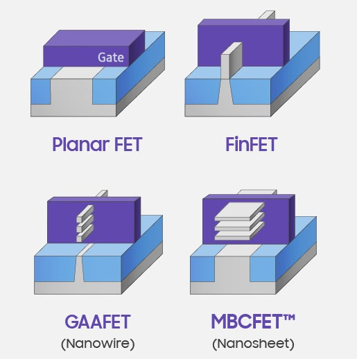
 
根据IBS（International Business Strategies）的估计，3nm工艺将会需要40-50亿美金来开发制程技术，月产40,000片wafer的工厂需要150亿到200亿美金的建设费用。
https://www.extremetech.com/computing/272096-3nm-process-node

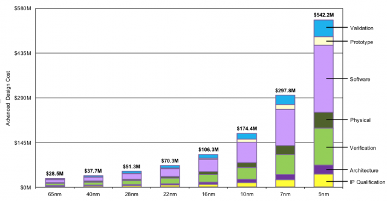

IBS进一步指出，使用5nm的客户将需要支出5亿美金来开发制程技术，而3nm的芯片开发费用将会上涨至多达15亿美金去开发例如GPU这样的高端计算芯片。随着制程技术提升，单位面积transistor密度有所提升，3nm可望达到每平方毫米300M transistor密度，但是3nm的transistor cost将会比5nm贵20-25%，带来5%左右的性能提升和15%左右的功耗降低（https://www.phonearena.com/news/tsmc-3nm-chips-will-contain-nearly-300-million-transistors-per-square-mm_id123963）。 相比之下，在7nm以上的制程中，每一代制程的引入，相同芯片设计通常带来40%的性能提升和50%面积减少，由此可见摩尔定律虽然没有停滞，但是每一代制程带来的收益已经大大减少了。

半导体市场已经出现了分化，大量的半导体公司会在28nm附近，而且因为没有使用FinFET工艺，因为其设计成本只有10M，transistor的单价也是最低的，大量对高性能和低功耗要求不高的客户将会停留在这个制程。接下来是使用FinFET工艺的16/14nm，全球只有5家foundry，包括TSMC，Samsung，UMC，GlobalFoundry，SMIC和Intel，他们主要面向高性能的CPU，GPU，FPGA，AI芯片等市场。使用EUV光刻的7nm和5nm制程只有TSMC和Samsung，他们的主要市场是手机SoC，高端CPU，GPU和AI等追求极致性能和功耗要求的应用。
从产业角度来讲，3nm主要的目标应用市场智能手机，已经连续出现了2年的市场下滑，加上全球covid19疫情的爆发，全球经济已经陷入衰退，加上美中科技脱钩带来的产业链投资碎片化，3nm技术可能会大大延后，Samsung和TSMC都延缓了3nm制程的引入时间。因为中美科技竞争导致的供应链独立，将会加剧脱离对现有的基于制程的增长模式的依赖，3-5年内随着国产替代在DUV产业将会出现大量的产能，持续降低DUV制程的成本，同时将会广泛采用开源芯片、开源EDA、3D集成，chiplet等超越性技术来构建非美的半导体设计和生产制造体系。而EUV产业长期面临高端应用不足的，从而拉长投资，放慢增长，加剧侵蚀现有的增长模式。

半导体产业发展历史上，DARPA的前瞻性的技术投资起到了很大的作用，包括投资1980年代的 MOSIS （Metal Oxide Silicon Implementation Service) 代工服务 ，开创了现代半导体foundry的服务模式，大幅度降低了半导体设计生产制造的成本，1990年代牵头产业和学术界研发了193nm光刻技术，为半导体产业近20多年的增长打下了基础，1996年当产业界还在250nm工艺的时候，DARPA敏锐的发现25nm之下摩尔定律的增长将会停止，必须要预研新的技术，对胡正明教授递交的FinFET晶体管构型做了投资，1999年FinFET论文发表（https://spectrum.ieee.org/semiconductors/design/the-origins-of-intels-new-transistor-and-its-future），直到12年后Intel首次在22nm使用了FinFET技术，避免了产业的停滞，是非常典型的规划主导型的创新，是半导体产业的第三次创新，随着半导体产业靠制程缩减芯片尺寸的创新也渐渐进入平台期，DARPA提出了电子复兴计划（Electronic Resurgence Initiative），ERI启动于2017年，为期5年，投资14亿美元，包括了政府和企业的投资，主要投资美国的大学和企业承担的技术项目。DARPA认为这是半导体产业的第四次创新，主要解决4个挑战
 -	提升未来半导体器件的性能，
 -	解决数据爆炸带来的信息处理能力问题
 -	解决高昂的芯片设计成本
 -	解决芯片设计和生产产业链的可信和安全	

DARPA ERI 提出的这些挑战具有风向标的意义，尤其考虑到ERI项目提出的的背景，因为7nm 以上的先进制程首先满足的是民用市场，而且门槛奇高，先进制程的芯片设计价格已经不是军事应用可以承担的，先进制程的工厂集中在越来越少的厂家，而且都不在美国国内，随着芯片的软件和硬件日益复杂，供应链的全球化，如何能够保证在民用的半导体foundry制造安全可信的芯片。结合前面对半导体产业界在DUV和EUV工艺上的分野，业界大多数客户面临的挑战和DARPA ERI 有类似的地方，即当先进制程不可追求的时候，是否还有其他手段能够大幅度降低芯片设计和开发成本，大幅度提升性能。EUV产业继续延续工艺缩短是曲高和寡的第一条路线，DARPA ERI目前赞助20个项目可以看作是在现有制程技术基础上演进的第二条路线的一个技术规划，DARPA ERI项目的中最重要的使命可以归结为，如何通过设计方法、设计工具、计算架构和制造技术的的颠覆式变革，大大降低面向领域应用的SoC芯片的开发成本、周期、制造和组装成本，并且达到整个设计和生产流程的安全和可信。同时通过政府和工业界对学校基础研究的大力投入，保障半导体产业人才的供给。ERI和半导体产业对产业未来10年的路标基本达成共识。

如下图所示，综合ERI的布局和其他产业的规划，未来计算产业将会在体现出下面的几个特点

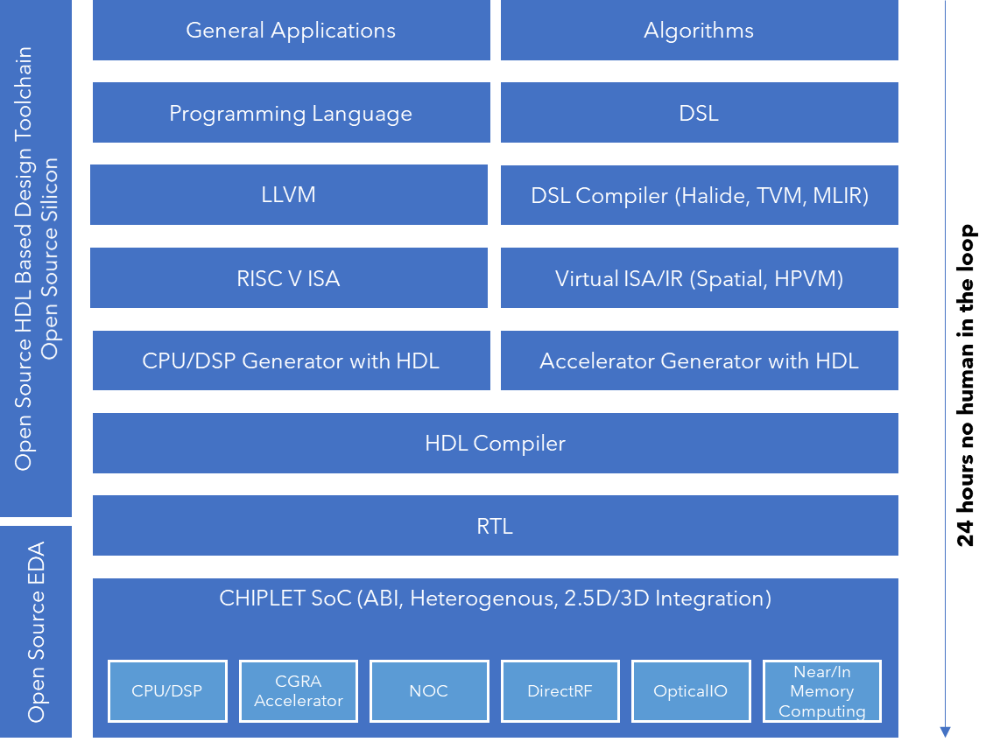

- CPU和加速器设计流程和工具全面软件化，从CAD（Compter Aided Design）变为AAD（AI Aided Design），实现从算法问题到加速器的自动化，大大降低DSA设计的人力和资本投入
- 基于开源将会形成类似软件领域的大型生态，包括EDA生态，DSL语言生态，开源芯片/IP生态，基于开源标准的chiplet生态，这些生态的构建布局将会是产业争夺主导权的重点，结合供应链可能形成不同的产业联盟
- 云计算、AI平台公司将会利用芯片产业的结构性变化成为重要的产业推动力量

下面主要总结一下ERI在DSL/DSA，EDA和Chiplet领域的技术布局。

## 1、	针对domain specific问题的计算机体系架构，相比通用处理器1000x的功效提升

为domain specific应用建立一个从DSL到DSA的端到端的方法和工具，降低domain specific应用的开发和应用成本，加快创新速度。典型的领域应用包括图计算、软件定义的无线电，深度学习和ML，特点是支持TOPS的处理速度和相比通用计算100~1000倍以上的计算能效比，这也是当前计算机体系架构的热点应用领域。ERI定义了两个相关的项目，DSSoC（Domain Sepcific System on Chip）和SDH（Software Defined Hardware），DSSoC主要面向edge部署的软件定义的无线电和计算机视觉应用，通用CPU的可编程性很好，软件生态丰富，但是在处理专用场景的计算功效不高，DSP，TPU这类的专用处理器，处理专用场景的性能功效高，但是可编程能力不高。DSSOC希望寻求可编程易用性和专用性能提升之间的平衡，提供端到端的从应用到DSL编程语言到OS和runtime，直DSSoC芯片的全栈技术方案。

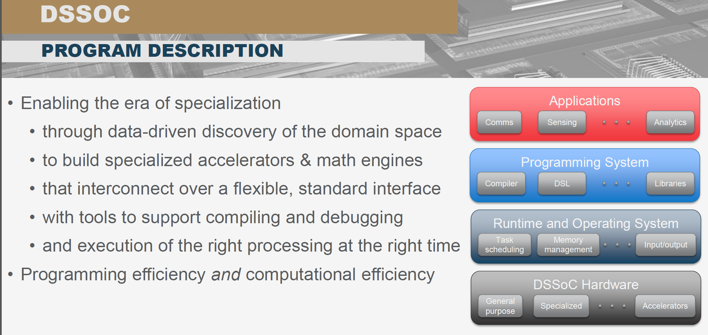

UIUC提出的HPVM定义了一个较为通用的DSL的IR和DSA的ISA，目标在于定义一个标准的DSL到DSA的标准界面，Spandex定义了具备可编程能力的加速器之间的cache可配置的数据访问接口。

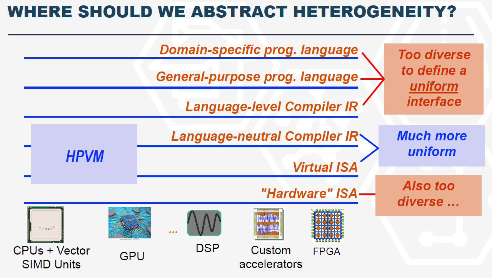

斯坦福的AHA（Agile Hardware）针对图像处理和计算机视觉使用的Halide DSL使用他们的HDL语言和accelerator实现了一个DSA加速器。

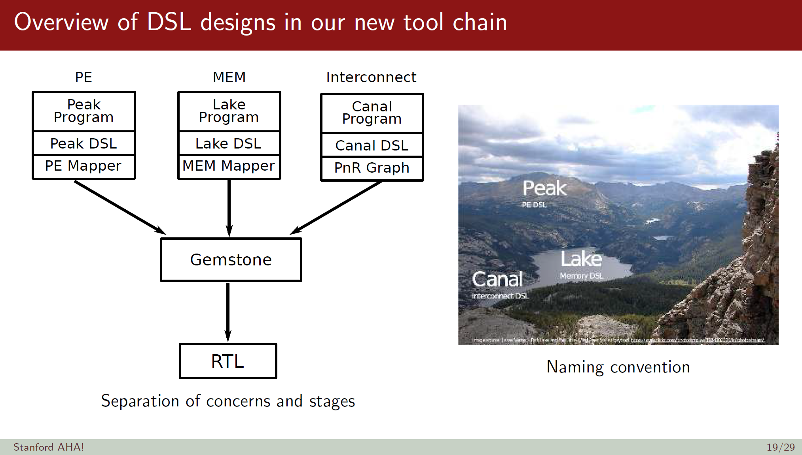

相比DSSoC，SDH（Software Defined Hardware）强调底层可编程的硬件架构，因为针对算法优化的硬件架构迥异，为每个算法开发一个芯片成本过高，可编程的FPGA性能和ASIC相比又有较大差距，SDH目标是基于粗粒度可编程阵列（Coarse Grained Reconfigurable Array ）实现对不同算法的动态重新配置。FPGA可以实现gate级别的可编程功能，属于细粒度的可编程阵列，为了支持这种细粒度的可编程能力，40%的FPGA芯片面积被用来实现gate的连接，而CGRA把编程粒度提升到了较高的算法内核的计算和内存管理层面，降低了可编程粒度，但是有效提升了计算密度和功效。比较多的CGRA架构是一个同构对称的计算和存储分片，这些分片之间通过片上网络实现高速联通，达到任何分片之间的访问，可配置的是一个计算图在CGRA资源拓扑上的映射。

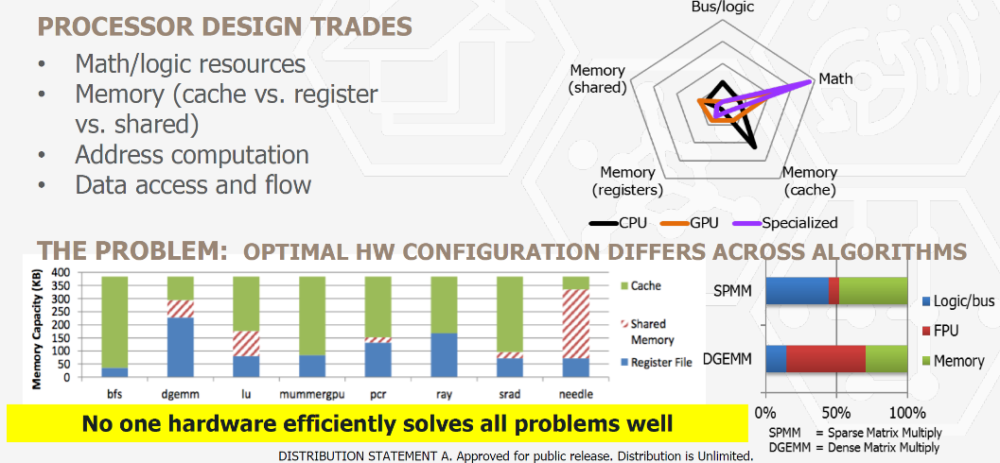

SDH终极目标是能够实现相比CPU 1000x的计算能效比和同样的软件可编程能力，硬件能够在300-1000ns内重新配置。

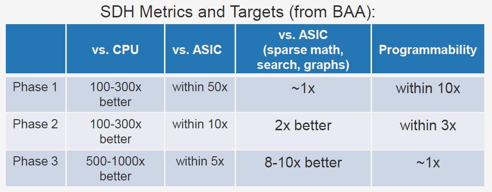

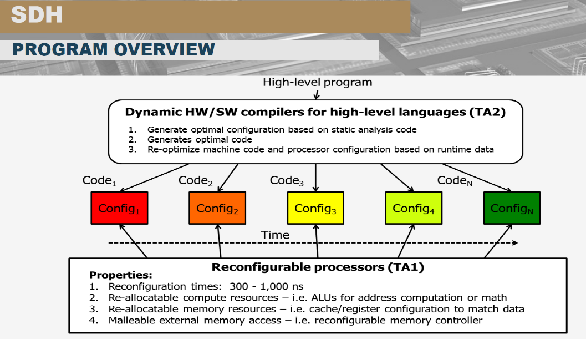

SDH项目有斯坦福并行计算实验室的Kunle Olukotun教授，他的研究小组是DSL和DSA领域的顶级团队，他们发布的Spatial 编程语言和Plasticine CGRA硬件架构完整实现了端到端的从算法问题到加速器的实现，并且Kunle教授和斯坦福的 NLP 大牛Christopher Re以及前Sun Sparc处理器的主任设计师Rodrigo Liang一起创立了SombaNova AI 芯片公司，迄今已经融资4.7亿美金，基于7nm工艺的Cardinal SN10芯片具备高达100TOPs的算力，具备training和inference的能力，直接挑战主流的GPU方案。在上百家的AI芯片创业公司中，SombaNova是不多的软件定义芯片的厂家，根据目前公开的信息他们的芯片主要基于他们论文发布的Spatial DSL和Plasticine CGRA架构（https://youtu.be/E7se0KEa4BY），这也是SDH思想的最早的商用。

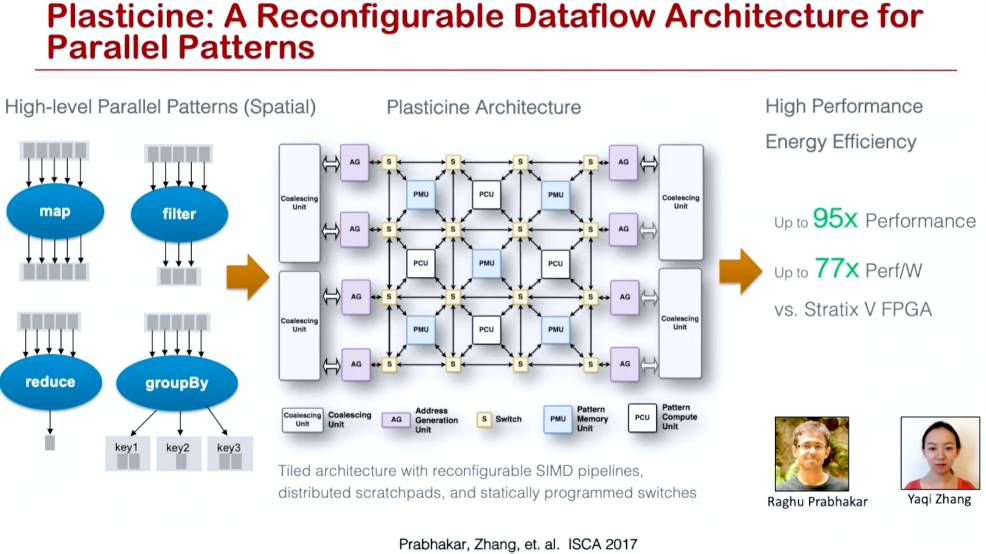

SDH另外一个项目是MIT的Saman Amarasinghe教授领导的tensor algebra processor（张量代数处理器），他的研究小组开发了很多重要的DSL语言，他的学生Jonathan Ragan-Kelley 设计的Halide 图像处理DSL已经被Google、Qualcomm采用作为其图像处理芯片的编程语言，实现了DSL从语言到芯片的闭环 （https://people.eecs.berkeley.edu/~jrk/）。Halide的设计思想也启发了几个其他非常有影响力的DSL，例如：做DL硬件编译的TVM，作为FPGA DSL的HeteroCL等。

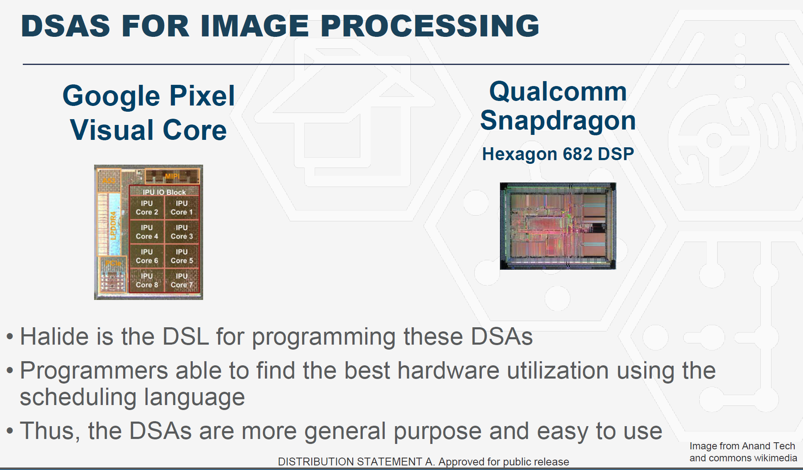

他们设计的TACO DSL是一个张量代数编译器（Tensor Algebra ）（http://tensor-compiler.org/），tensor这种多维矩阵数据结构广泛应用于ML、图计算和科学计算，为此已经存在了大量的计算模板，即所谓的kernel，但于此同时，现实世界中tensor的数据一般是是非常稀疏的，即大多数的数据都是0，如果不利用稀疏性，计算模式比较简单，例如：一个两维矩阵相乘的算法如果不考虑稀疏性只需要12行代码，但是如果要扣除矩阵中的0数据，则需要手工写100行代码。TACO设计了一种数据结构，可以只存储非0的数据，大大压缩了需要的计算和存储需求。Amazon公布了一个包括稀疏的保护所有0元素的tensor数据集，存储容量是107 exabyte，经过TACO表征之后，数据被压缩为13 gigabyte，压缩率为10M，使用TACO，tensor计算开发者可以使用简单易用的高层DSL来描述计算过程，TACO会自动产生考虑了稀疏性的计算代码，代码优化的水平达到或者超过了手工优化的水平。（http://news.mit.edu/2017/faster-big-data-analysis-tensor-algebra-1031, http://tensor-compiler.org/）。

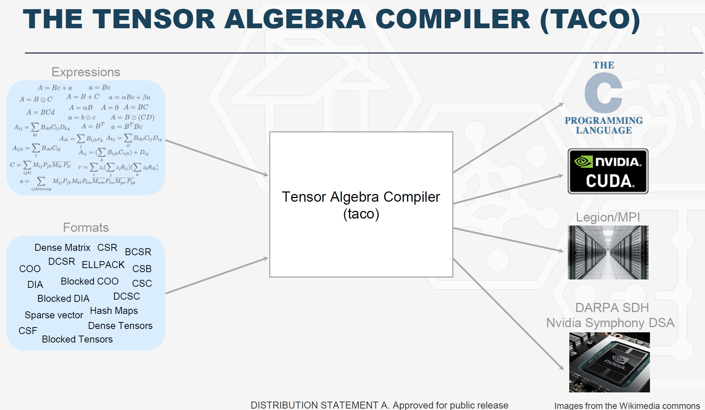

UIUC和Nvidia团队基于TACO DSL 开发了Extensor加速器
https://dl.acm.org/doi/10.1145/3352460.3358275

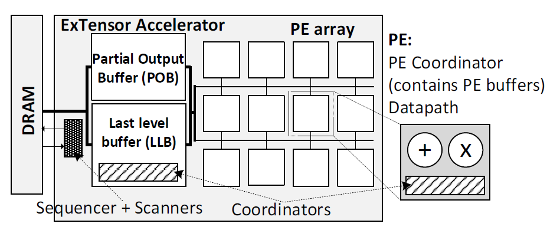

ERI项目基本涵盖了DSL和DSA领域最好的研究团队，其研究成果都已经开源，基于他们的基础研究，产业已经在跟进做商业化实现，主要应用于AI、图计算等领域。ERI设置的即有通用计算可编程的应用性，又能对domain 问题提升1000倍的计算能效比的目标一旦实现，整个计算产业都会为之改变。

## 2、	基于开源和AI的EDA设计工具和流程，借鉴软件的开发方法设计芯片，24小时无人工干预从代码到芯片实现

## 3、建立chiplet产业联盟，实现低成本小规模芯片的快速创新，通过使用3D堆叠实现落后工艺对先进工艺的反超

